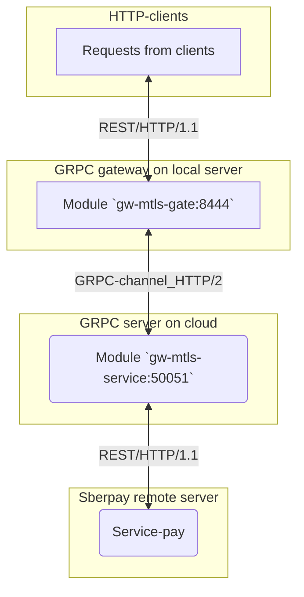

## Тестовый шлюз платежного сервиса Сбербанка. SberPay  
## Содержание
- [Описание](https://github.com/blablatov/gosberpay/blob/master/README.md#Описание-Description)  
- [Сборка сервиса](https://github.com/blablatov/gosberpay/blob/master/README.md#Сборка-локально-и-в-Yandex-Cloud-Build-local-and-to-Yandex-Cloud)
- [Тестирование сервиса](https://github.com/blablatov/gosberpay/blob/master/README.md#Тестирование-локально-и-в-Yandex-Cloud-Testing-local-and-to-Yandex-Cloud)
- [Тестирование запросов](https://github.com/blablatov/gosberpay/blob/master/README.md#Ответ-боевого-сервера-Сбербанка)
- [Блок-схема обмена данными](https://github.com/blablatov/gosberpay/blob/master/README.md#Блок-схема-обмена-данными-Block-diagram-of-work)

### Описание. Description  
Тестовый вебсервер `gosberpay.go` для отладки REST запросов, интернет-эквайринг сервиса Сбербанка.  
Без доступа к боевому серверу Сбербанка, тестирование регистрации заказа осуществляется локально посредством тестового `rest`- запроса с нужными данными.   
Запрос `register` возвращает номер заказа `orderId` и сообщение `Запрос регистрации методом register.do - ОК!` или описание ошибки.    
Запрос `getOrderStatusExtended` возвращает данные статуса заказа или описание ошибки:

	Order status: {"ErrorCode":"0","ErrorMessage":"Успешно","OrderNumber":"0784sse49d0s134567890","OrderStatus":"6","ActionCode":"-2007","ActionCodeDescription":"Время сессии истекло"}
 
[Интерфейс REST SberPay](https://securepayments.sberbank.ru/wiki/doku.php/integration:api:rest:start)    
  
[Для Alfa API здесь](https://developers.alfabank.ru/products/alfa-api/documentation/development/specification/introduction)  
	

Реализован обмен данными по gRPC каналу через `gRPC-шлюз` с поддержкой HTTP `mtls-grpc-gateway`.  
Клиентские приложения могут обращаться к `gRPC`-сервису по `gRPC` или `REST`.     

### Сборка локально и в Yandex Cloud. Build local and to Yandex Cloud  
[:arrow_up:Содержание](#Содержание)  
#### Локально. Local: 
	go build ./..
или  

	cd ./mtls-grpc-gateway/gw-mtls-gate 
 	go build .
  	./gw-mtls-gate  
 	cd ./mtls-grpc-gateway/gw-mtls-service
  	go build .
   	./gw-mtls-service    
или  

	docker build -t gosberpay -f Dockerfile  
	
#### Облако. Cloud  
	sudo docker build . -t cr.yandex/${REGISTRY_ID}/debian:gosberpay -f Dockerfile

### Тестирование локально и в Yandex Cloud. Testing local and to Yandex Cloud  
[:arrow_up:Содержание](#Содержание)  
#### Локально. Local: 
Тестирование веб-сервера:  

	cd ./rest
	go test -v register_test.go    
	go test -v getOrderStatusExtended_test.go  
Тестирование grpc-шлюза:  

	cd ./mtls-grpc-gateway/gw-mtls-gate  
 	go test -v .
  	go test --bench=.  
Тестирование логики удаленных методов grpc-сервиса без передачи данных по сети, имитация запуска сервера с использованием буфера:  

	cd ./mtls-grpc-gateway/gw-mtls-service  
 	go test -v .  
 		
	
#### Облако. Cloud  

	sudo docker run --name gosberpay -p 8443:8443 -d cr.yandex/${REGISTRY_ID}/debian:gosberpay  
 Тестирование веб-сервера:  
 
 	cd ./rest
	go test -v register_test.go  
	go test -v getOrderStatusExtended_test.go  
 Тестирование grpc-шлюза:  
 
 	cd ./mtls-grpc-gateway/gw-mtls-gate  
 	go test -v .
  	go test --bench=.

   
### Использование. How use  

	./gosberpay
	./gw-mtls-gate  
	./gw-mtls-service   
	
### Ответ боевого сервера Сбербанка:
[:arrow_up:Содержание](#Содержание)  
#### на запрос регистрации заказа (`register`)с недостоверным ID в запросе (нет регистрации):   
	Status = 200 OK 2023/09/23 15:49:28 
	Response of server:
 	{"errorCode":"5","errorMessage":"Access denied"}
	
#### на запрос состояния заказа (getOrderStatusExtended) нет регистрации:  
	Status = 200 OK 2023/10/10 12:17:08 
	Response of server: 
	{"errorCode":"5","errorMessage":"[userName] or [password] or [token] is empty"}  
 
	
### Блок-схема обмена данными. Block diagram of work     
[:arrow_up:Содержание](#Содержание)  
			

  
  