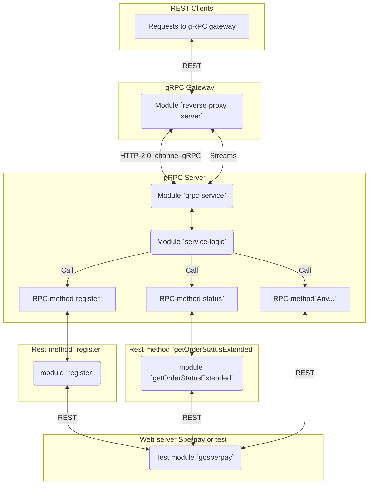

### gRPC-service and gRPC-gateway via mTLS.  
***Блок-схема обмена данными (scheme exchange of data):*** 

```mermaid
graph TB

  subgraph "Rest-method `getOrderStatusExtended`"
  SubGraph6Flow(module `getOrderStatusExtended`)
  end

  subgraph "Rest-method `register`"
  SubGraph5Flow(module `register`)
  end

  subgraph "Web-server Sberpay or test"
  SubGraph4Flow(Test module `gosberpay`)
  SubGraph4Flow
  end

  SubGraph1Flow
  subgraph "gRPC Server"
  SubGraph1Flow(Module `grpc-service`)
  SubGraph1Flow <--> SubGraph3Flow
  SubGraph3Flow(Module `service-logic`)
  SubGraph3Flow -- Call --> RPC-method`register` <--> SubGraph5Flow <-- REST --> SubGraph4Flow
  SubGraph3Flow -- Call --> RPC-method`status` <--> SubGraph6Flow <-- REST --> SubGraph4Flow
  SubGraph3Flow -- Call --> RPC-method`Any...` <-- REST --> SubGraph4Flow
  end
 
  subgraph "gRPC Gateway"
  SubGraph2Flow(Module `reverse-proxy-server`)
  SubGraph2Flow <-- HTTP-2.0_channel-gRPC --> SubGraph1Flow
  SubGraph2Flow <-- Streams--> SubGraph1Flow
  end

  subgraph "REST Clients"
  Node1[Requests to gRPC gateway]
  Node1 <-- REST--> SubGraph2Flow  
end
```  
   

